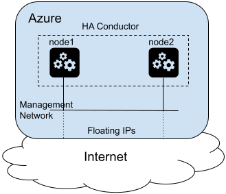

# Session Smart Conductor Azure Terraform Example

## Topology
The terraform in this repo will generate the topology shown below. This consists of a new virtual network with a single subnet. It creates two public IPs (one for each conductor node) and two network interfaces (one for each conductor node). It creates a VM for each conductor node based on an official Session Smart Router image and prepares cloud-init data that will allow the two nodes to Initialize as an HA pair.


## Steps to Run
1. Login to Azure. Install the Azure CLI following [Microsoft's Documentation](https://docs.microsoft.com/en-us/cli/azure/install-azure-cli). After installation run the command `az login` to authenticate to your account. This will open a browser to complete the login process.
> **Note:** If your login is linked to multiple accounts you should run `az login --tenant TENANT_ID` indicating the subscription you wish to use

2. Create a file named `me.auto.tfvars` to set variable values. There are many variables that can be overridden, but most can be left at their defaults, depending on your requirements. The terraform does assume a resource group has been created in the Azure account in advance and we need to set a value for it in this file, as shown in the example below.
```
azure_resource_group_name = "128Technology"
```

3. Copy in or generate your public and private keys. The two conductor nodes communicate over ssh encryption. We must pre-generate the SSH keypairs so that we can pre-share the public keys across the two nodes in advance. If you have previously saved the PDC keys from an HA system, you may place the public and private keys in the following files:
* conductor1_pdc_ssh_key - private PDC SSH key for node1
* conductor1_pdc_ssh_key.pub - public PDC SSH key for node1
* conductor2_pdc_ssh_key - private PDC SSH key for node2
* conductor2_pdc_ssh_key.pub - public PDC SSH key for node2

If you wish to generate new PDC SSH keys, you can use the following commands. Hit enter when prompted for a password to generate password-less keys:
```
ssh-keygen -f conductor1_pdc_ssh_key -b 2048
ssh-keygen -f conductor2_pdc_ssh_key -b 2048
```

In addition, the Conductor runs a salt master. This public private keypair must be the same on both conductor nodes. If you have previously saved the salt master keys, you may place them in the following files:
* master.pem - salt master RSA public key
* master.pub - salt master RSA private key

If you wish to generate new salt master keys, you can use the following commands:
```
openssl genrsa -out master.pem 2048
openssl rsa -in master.pem -pubout > master.pub
```

4. Initialize the terraform repo and apply the configuration. Terraform should use the authentication key from Step 1 when communicating to the Azure APIs.
```bash
terraform init
terraform apply
```
After building the environment, the public IP addresses for each conductor node will be returned.

## Steps to Tear Down
To destroy all resources that were built in this topology, run the following commands
```bash
terraform destroy
```
